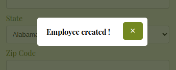

# react-modal-stelda

## Description

This Modal component allows you to display a simple and customizable modal window in React.



## Installation

You can install the component via npm or by cloning the GitHub repository.

### Via npm

```bash
npm install react-modal-stelda
```

### Via github

```bash
git clone https://github.com/stelda/react-modal-stelda.git
cd react-modal-stelda
npm install
```

## Usage

Here is an example of how to use the Modal component:

```jsx
import React, { useState } from 'react';
import Modal from 'react-modal-stelda';
import 'react-modal-stelda/dist/modal.css'; // Make sure to import the associated CSS

function App() {
    const [isModalOpen, setIsModalOpen] = useState(false);

    const openModal = () => setIsModalOpen(true);
    const closeModal = () => setIsModalOpen(false);

    return (
        <div>
            <button onClick={openModal}>Open Modal</button>
            <Modal
                isOpen={isModalOpen}
                onClose={closeModal}
                message="This is a modal message."
            />
        </div>
    );
}

export default App;
```

## Props

The Modal component accepts the following props:

- `isOpen` (boolean): Whether the modal is open or not.
- `onClose` (function): Function to call when the modal is closed.
- `message` (string): The message to display in the modal.

## Styles

To customize the modal styles, you can modify the CSS classes provided by the component.
The following classes are available:

- `.modal-overlay`: The overlay behind the modal.
- `.modal-content`: The modal window.
- `.modal-close`: The close button.
- `.modal-message`: The message inside the modal.

## Contribution
If you wish to contribute to the development of this component, follow these steps:

1. Fork the repository.
2. Create a branch for your changes (`git checkout -b feature/your-feature`).
3. Commit your changes (`git commit -m 'Add some feature'`).
4. Push to the branch (`git push origin feature/your-feature`).
5. Open a Pull Request.

## Authors
https://github.com/stelda
